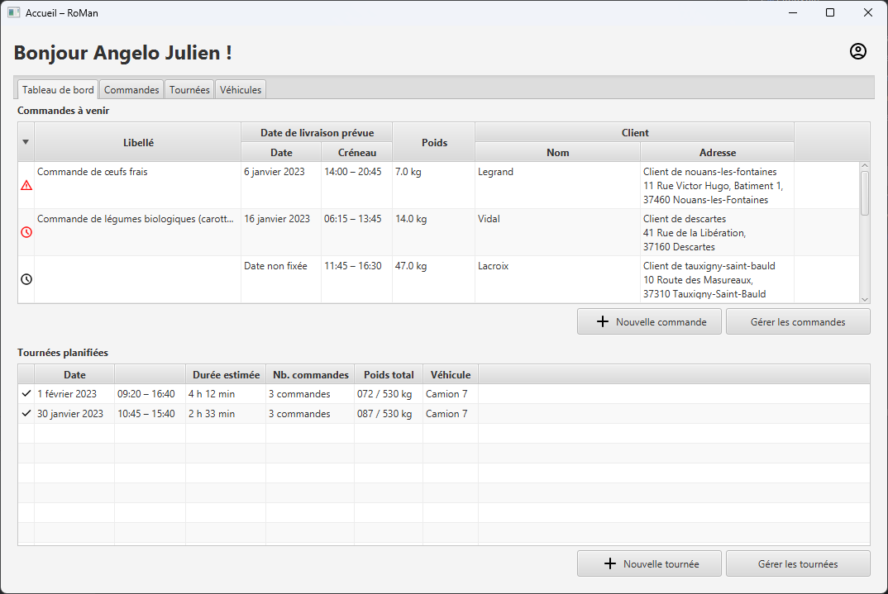

# RoMan

*Application de conception et visualisation de tournées agricoles en circuits courts*

Axel Leblanc, Valentin Leclair, Marius Maury, Pierre Saussereau



## Configuration

- **Version de Java :** Java SE 17
- **Système de gestion de base de données (SGBD) :** MySQL ou MariaDB
- ***Build System :*** Maven
- **Bibliothèques :**
  - JavaFX 19 (`org.openjfx:javafx-controls`)
  - MySQL Connector/J (`com.mysql:mysql-connector-j`) `8.0.31`
  - JUnit (`org.junit.jupiter:junit-jupiter`) `5.9.0`
  - Gluon Maps (`com.gluonhq:maps`) `2.0.0-ea+6`
  - JFXtras (`org.jfxtras:jfxtras-controls`) `17-r1`
  - Gson (`com.google.code.gson:gson`) `2.10`
  - *Voir le ficher `pom.xml`*

Le projet a été testé avec MariaDB `10.4.*`, sous Windows 10/11 et macOS.

### Configuration de la base de données et connexion

Créer une base de données (par exemple `roman`) et y importer le dump fourni avec le jalon 3 (il
contient la structure de la base, il n'est donc pas utile d'importer le DDL).
Créer un utilisateur (par exemple `roman`) ayant les privilèges suivants sur l'ensemble des 
tables de la base : 
`SELECT, INSERT, UPDATE, DELETE`.

Pour permettre à l'application de se connecter à la base, créer le fichier
`src/main/resources/connectionBDD.txt`.
Celui-ci s'organise de la manière suivante (en adaptant les informations situées après le symbole 
`=`) :

```text
url=jdbc:mysql://localhost:3306/roman
login=roman
password=MOT_DE_PASSE
```

### Exécution de l'application

L'application s'exécute via le plugin JavaFX pour Maven : `javafx:run`.
Le projet n'est pas modulaire (*non-modular*).

Plus d'informations sur la [documentation de JavaFX](https://openjfx.io/openjfx-docs).

> Si l'application ne fonctionne pas, vérifier que la variable d'environnement `JAVA_HOME` est bien
> définie et pointe sur l'emplacement du JDK.
